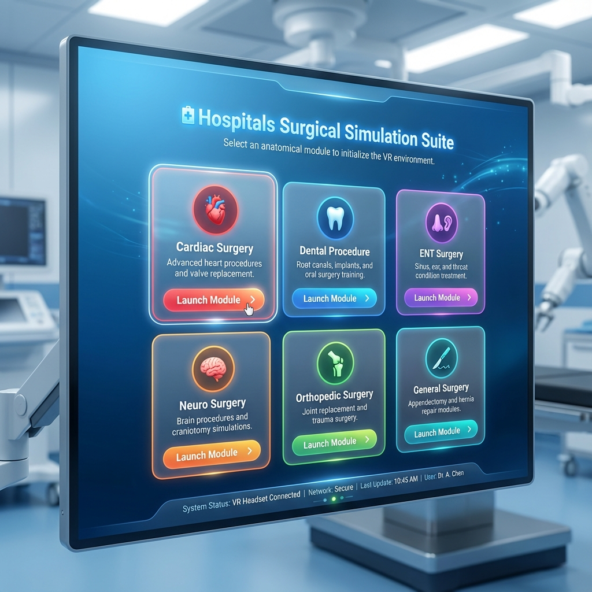

# 🏥 Surgical Simulation Suite

A modern PyQt5-based VR launcher for medical simulation training. This application provides a sleek, user-friendly interface to launch various Unity-based surgical simulation modules.


## ✨ Features

- **🎨 Modern UI**: Beautiful gradient-based design with smooth animations and hover effects
- **🔄 Dynamic Card System**: Interactive cards for each simulation module with status indicators
- **⚙️ Easy Configuration**: Browse and configure executable paths through the GUI
- **🚀 Quick Launch**: One-click launching of VR simulation environments
- **📊 Status Tracking**: Real-time status indicators showing which simulations are ready
- **🎯 Multi-Module Support**: Supports various surgical simulation types:
  - ❤️ Cardiac Surgery VR
  - 🟤 Hepatic Procedures VR
  - 🦷 Dental Training VR
  - 💧 Vascular Flow VR
  - 👃 ENT Surgery VR
  - 🩺 Abdominal Trauma VR

## 🖼️ Screenshots


*Main launcher interface with simulation cards*

## 📋 Requirements

- Python 3.7 or higher
- PyQt5
- Windows OS (for .exe launching)

## 🔧 Installation

1. **Clone the repository**
   ```bash
   git clone https://github.com/yourusername/surgical-simulation-suite.git
   cd surgical-simulation-suite
   ```

2. **Install dependencies**
   ```bash
   pip install -r requirements.txt
   ```

3. **Run the application**
   ```bash
   python gui_vr.py
   ```

## 🎮 Usage

1. **First Launch**: 
   - Click the "⚙️ Configure Simulation Paths" button
   - Use the Browse button for each simulation to locate its Unity executable (.exe)
   - The status indicators will update to show which simulations are ready

2. **Launching Simulations**:
   - Click on any card with a "✅ Ready" status
   - Or click the "🚀 LAUNCH" button
   - The simulation will start in a new window

3. **Path Configuration**:
   - Paths are session-based by default
   - Update the `INITIAL_SIMULATIONS` list in `gui_vr.py` for permanent paths

## ⚙️ Configuration

Edit the `INITIAL_SIMULATIONS` list in `gui_vr.py` to customize your simulation modules:

```python
INITIAL_SIMULATIONS = [
    {
        "name": "Heart",
        "icon": "❤️",
        "description": "Cardiac Surgery VR",
        "exe_path": r"C:\path\to\your\simulation.exe",
        "color": "#D64545"
    },
    # Add more simulations...
]
```

### Color Customization

Each simulation card can have a custom color scheme. Modify the `color` field in the simulation dictionary with any hex color code.

## 🏗️ Project Structure

```
surgical-simulation-suite/
│
├── gui_vr.py              # Main application file
├── requirements.txt       # Python dependencies
├── README.md             # This file
├── .gitignore            # Git ignore rules
└── screenshots/          # Application screenshots
```

## 🎨 Design Features

- **Glassmorphism Effects**: Modern translucent card designs
- **Smooth Animations**: Hover effects with elevation changes
- **Responsive Layout**: Grid-based layout that adapts to window size
- **Color-Coded Cards**: Each simulation type has its own color theme
- **Status Indicators**: Visual feedback for simulation availability

## 🐛 Troubleshooting

### Simulation Won't Launch
- Ensure the executable path is correct
- Check that the Unity `*_Data` folder is in the same directory as the .exe
- Verify you have the necessary permissions to run the executable

### Path Not Found
- Use the configuration dialog to browse for the correct .exe file
- Check that the simulation build is complete and not corrupted

## 🤝 Contributing

Contributions are welcome! Please feel free to submit a Pull Request.

1. Fork the repository
2. Create your feature branch (`git checkout -b feature/AmazingFeature`)
3. Commit your changes (`git commit -m 'Add some AmazingFeature'`)
4. Push to the branch (`git push origin feature/AmazingFeature`)
5. Open a Pull Request

## 📝 License

This project is licensed under the MIT License - see the [LICENSE](LICENSE) file for details.

## 👥 Authors

- Your Name - Initial work

## 🙏 Acknowledgments

- Built with PyQt5
- Designed for Unity-based medical simulations
- Inspired by modern UI/UX design principles

## 📧 Contact

For questions or support, please open an issue on GitHub.

---

**Note**: This launcher requires Unity simulation builds (.exe files) to function. The simulation executables are not included in this repository.
